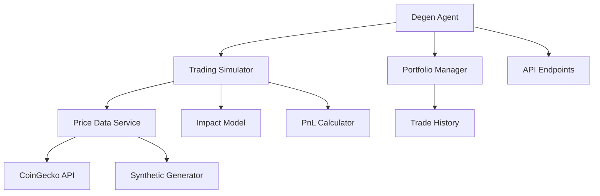

# Degen Trading Simulator Design Document

## Overview

The Degen Trading Simulator is a comprehensive simulation engine that models trading positions based on AI-generated decisions without executing real transactions. The system integrates with the existing degen-agent to provide realistic trading simulation with price impact modeling, fee calculations, and multi-horizon PnL tracking.

The simulator fetches real market data when available and falls back to synthetic price generation using geometric Brownian motion. It maintains an in-memory portfolio state and provides API endpoints for accessing simulation results and trade history.

## Architecture

The system follows a modular architecture with clear separation of concerns:



### Core Components

1. **Trading Simulator**: Main simulation engine that orchestrates position simulation
2. **Price Data Service**: Handles real and synthetic price data acquisition
3. **Impact Model**: Calculates price impact and slippage effects
4. **PnL Calculator**: Computes profit/loss across multiple time horizons
5. **Portfolio Manager**: Maintains simulated capital and trade history
6. **API Layer**: Provides REST endpoints for accessing simulation data

## Components and Interfaces

### Trading Simulator Module (`degen-agent/sim/trading-simulator.js`)

```javascript
interface SimulationOptions {
  token: string;
  decision: 'LONG' | 'SHORT';
  entryPrice: number;
  capitalUsd: number;
  sizingPercent: number;
  horizons: number[];
  options?: {
    seed?: number;
    impactCoeff?: number;
    feeRate?: number;
    liquidityUsd?: number;
  };
}

interface SimulationResult {
  entryPrice: number;
  entryFillPrice: number;
  positionUsd: number;
  capitalUsd: number;
  decision: string;
  snapshots: PnLSnapshot[];
  finalPnlUsd: number;
  finalRoi: number;
  meta: {
    priceSource: 'coingecko' | 'synthetic';
    impactApplied: number;
    feesApplied: number;
  };
}

async function simulateTrade(options: SimulationOptions): Promise<SimulationResult>
```

### Price Data Service

```javascript
interface PriceDataService {
  fetchCoinGeckoData(coinId: string): Promise<PricePoint[]>;
  generateSyntheticSeries(seedPrice: number, points: number, seed?: number): PricePoint[];
  mapSymbolToCoinId(symbol: string): string;
}

interface PricePoint {
  timestamp: number;
  price: number;
}
```

### Portfolio Manager

```javascript
interface Portfolio {
  capitalUsd: number;
  tradeHistory: TradeRecord[];
  createdAt: Date;
  lastUpdated: Date;
}

interface TradeRecord {
  id: string;
  token: string;
  decision: 'LONG' | 'SHORT';
  entryPrice: number;
  entryFillPrice: number;
  positionUsd: number;
  finalPnlUsd: number;
  finalRoi: number;
  createdAt: Date;
}
```

## Data Models

### Simulation Snapshot

```javascript
interface PnLSnapshot {
  horizonSeconds: number;
  timestamp: number;
  marketPrice: number;
  effectivePrice: number;
  pnlUsd: number;
  roi: number;
  decayFactor: number;
}
```

### Configuration Model

```javascript
interface SimulatorConfig {
  capitalUsd: number;        // SIM_CAPITAL_USD (default: 100)
  sizingPercent: number;     // SIM_SIZING_PERCENT (default: 0.5)
  impactCoeff: number;       // SIM_IMPACT_COEFF (default: 0.0005)
  feeRate: number;           // SIM_FEE_RATE (default: 0.001)
  defaultLiquidityUsd: number; // SIM_DEFAULT_LIQUIDITY (default: 20000)
  horizons: number[];        // Default: [60, 300, 3600, 86400]
}
```

## Mathematical Formulas

The simulator implements the following mathematical models:

### Position Sizing
```
positionUsd = capitalUsd × sizingPercent
```

### Price Impact Model
```
priceImpact = impactCoeff × (positionUsd / marketLiquidityUsd)
entryFillPrice = seedPrice × (1 + sign × priceImpact)
where sign = +1 for LONG, -1 for SHORT
```

### Impact Decay Over Time
```
decayFactor = exp(-horizonSeconds / 3600)
effectivePrice_t = marketPrice_t × (1 + sign × priceImpact × decayFactor)
```

### PnL Calculation
```
fees = positionUsd × feeRate × 2  // roundtrip fees

For LONG positions:
pnlUsd = (effectivePrice_t / entryFillPrice - 1) × positionUsd - fees

For SHORT positions:
pnlUsd = (entryFillPrice / effectivePrice_t - 1) × positionUsd - fees

roi = pnlUsd / capitalUsd
```

### Synthetic Price Generation (Geometric Brownian Motion)
```
S(t+1) = S(t) × exp((μ - σ²/2) × dt + σ × sqrt(dt) × Z)
where:
- μ = drift rate (default: 0.0001)
- σ = volatility (default: 0.02)
- dt = time step (1 minute = 1/1440 days)
- Z = standard normal random variable
```

## Correctness Properties

*A property is a characteristic or behavior that should hold true across all valid executions of a system-essentially, a formal statement about what the system should do. Properties serve as the bridge between human-readable specifications and machine-verifiable correctness guarantees.*

### Property Reflection

After analyzing all acceptance criteria, several properties can be consolidated to eliminate redundancy:

- Configuration properties (5.1-5.5) can be combined into a single comprehensive configuration loading property
- API endpoint properties (4.1-4.3) are examples rather than universal properties
- Documentation properties (7.2, 7.4, 7.5) are examples rather than testable properties
- Warning display properties (4.5, 7.1, 7.3) can be combined into a single safety messaging property

### Core Properties

**Property 1: Position Creation Consistency**
*For any* valid trading decision (LONG/SHORT) with specified capital and sizing, the simulator should create a position with entry price, fill price (including impact), and position size that follow the mathematical formulas
**Validates: Requirements 1.1, 1.2, 1.3**

**Property 2: Multi-Horizon PnL Computation**
*For any* simulated position and price series, the simulator should generate snapshots for all specified time horizons with correct PnL and ROI calculations
**Validates: Requirements 1.4, 1.5**

**Property 3: Price Data Fallback Chain**
*For any* token symbol, the simulator should attempt CoinGecko lookup first, then fallback to synthetic generation if unavailable, with consistent timestamp handling
**Validates: Requirements 2.1, 2.2, 2.3, 2.5**

**Property 4: Deterministic Synthetic Generation**
*For any* seed value, synthetic price series generation should produce identical results across multiple runs
**Validates: Requirements 2.4, 6.4**

**Property 5: Portfolio State Management**
*For any* sequence of trade simulations, the portfolio should maintain capital and accumulate trade history with complete trade records
**Validates: Requirements 3.1, 3.2, 3.3, 3.4, 3.5**

**Property 6: Analysis Integration**
*For any* trading analysis request, the response should include properly formatted simulation data with safety warnings
**Validates: Requirements 4.4, 4.5**

**Property 7: Configuration Loading**
*For any* environment variable configuration, the simulator should use the specified values or appropriate defaults for all simulation parameters
**Validates: Requirements 5.1, 5.2, 5.3, 5.4, 5.5**

**Property 8: LONG/SHORT Symmetry**
*For any* identical market conditions, LONG and SHORT positions should produce inverse PnL results (excluding fees)
**Validates: Requirements 6.1, 6.2**

**Property 9: Graceful Degradation**
*For any* external API failure, the simulator should continue operation using synthetic data without errors
**Validates: Requirements 6.3, 6.5**

**Property 10: Safety Messaging**
*For any* simulation output or API response, appropriate "SIMULATION - NO REAL TXS" warnings should be prominently displayed
**Validates: Requirements 7.1, 7.3**

## Error Handling

The system implements comprehensive error handling across all components:

### Price Data Errors
- **CoinGecko API Failures**: Automatic fallback to synthetic price generation
- **Invalid Token Symbols**: Graceful handling with synthetic data and logging
- **Network Timeouts**: Retry logic with exponential backoff before fallback

### Simulation Errors
- **Invalid Parameters**: Input validation with descriptive error messages
- **Mathematical Edge Cases**: Handling of zero/negative prices and extreme values
- **Memory Constraints**: Efficient data structures for large price series

### Portfolio Errors
- **Insufficient Capital**: Validation of position sizing against available capital
- **State Corruption**: Defensive programming with state validation
- **Concurrent Access**: Thread-safe operations for portfolio updates

### API Errors
- **Malformed Requests**: Input validation and sanitization
- **Missing Resources**: Proper 404 handling for trade lookups
- **Server Errors**: Graceful degradation with partial data

## Testing Strategy

The testing strategy employs both unit testing and property-based testing to ensure comprehensive coverage:

### Unit Testing Approach
- **Specific Examples**: Test concrete scenarios with known inputs and expected outputs
- **Edge Cases**: Test boundary conditions like zero capital, extreme prices, and empty data
- **Integration Points**: Test API endpoints, configuration loading, and component interactions
- **Error Conditions**: Test all error handling paths and fallback mechanisms

### Property-Based Testing Approach
- **Library**: Use `fast-check` for JavaScript property-based testing
- **Iterations**: Configure each property test to run minimum 100 iterations
- **Test Tagging**: Each property test must include comment: `**Feature: degen-trading-simulator, Property {number}: {property_text}**`
- **Universal Properties**: Test mathematical relationships that should hold across all valid inputs
- **Generators**: Create smart generators that produce realistic trading scenarios

### Test Coverage Requirements
- **Mathematical Formulas**: Verify all PnL, impact, and fee calculations
- **Configuration**: Test all environment variable combinations
- **Data Sources**: Test both real and synthetic price data paths
- **API Contracts**: Verify all endpoint responses match expected schemas
- **Error Scenarios**: Test all failure modes and recovery mechanisms

### Deterministic Testing
- **Seeded Random Generation**: Use fixed seeds for reproducible synthetic price series
- **Mocked External APIs**: Control CoinGecko responses for consistent test results
- **Time-based Testing**: Mock system time for consistent timestamp-dependent calculations
- **Isolated State**: Reset portfolio state between tests to prevent interference