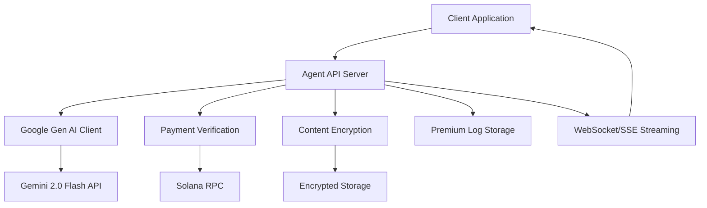

# Design Document

## Overview

This design implements Gemini 2.0 Flash Thinking Chain-of-Thought (CoT) functionality for the Degen agent, replacing prompt-based reasoning with native high-fidelity chain-of-thought extraction. The system will use Google's Generative AI SDK with `thinking_config.include_thoughts = true` to separate reasoning from final answers, persist encrypted thought data to premium logs, and stream thinking events to clients in real-time.

The implementation leverages existing payment verification and content encryption infrastructure while adding new Google Gen AI SDK integration and streaming capabilities.

## Architecture

### High-Level Components



### Request Flow

1. **Analysis Request**: Client requests token analysis with optional streaming
2. **Payment Check**: Verify premium access via existing payment verification
3. **Gemini Generation**: Call Gemini with thinking_config enabled
4. **Thought Extraction**: Parse response parts, separate thoughts from final answer
5. **Streaming**: Emit thinking events followed by final events
6. **Persistence**: Encrypt and store chain-of-thought in premium logs
7. **Response**: Return appropriate content based on payment status

## Components and Interfaces

### Google Gen AI Client Module

**Location**: `src/lib/google-gen-client.ts`

```typescript
export interface GoogleGenAIConfig {
  apiKey: string;
  model: string;
  temperature: number;
  maxTokens?: number;
  enableThoughts: boolean;
}

export interface ThoughtPart {
  text: string;
  thought: boolean;
  order: number;
  timestamp: number;
  tokenCount?: number;
}

export interface GenerationResult {
  finalAnswer: string;
  chainOfThought: ThoughtPart[];
  totalTokens: number;
  thoughtTokens: number;
  finalTokens: number;
}

export interface StreamingCallbacks {
  onThought: (thought: ThoughtPart) => void;
  onFinal: (text: string, isComplete: boolean) => void;
  onComplete: (result: GenerationResult) => void;
  onError: (error: Error) => void;
}

export class GoogleGenAIClient {
  generateWithThoughts(prompt: string): Promise<GenerationResult>
  streamWithThoughts(prompt: string, callbacks: StreamingCallbacks): Promise<void>
}
```

### Enhanced Agent Server

**Location**: `agent-server.js`

- Add WebSocket/SSE endpoints for streaming
- Integrate Google Gen AI client
- Handle thought vs final content routing
- Implement premium content gating

### Updated Type Definitions

**Location**: `src/types/index.ts`

```typescript
export interface ThoughtPart {
  text: string;
  thought: boolean;
  order: number;
  timestamp: number;
  tokenCount?: number;
}

export interface DegenAnalysisResponse {
  tokenSymbol: string;
  decision: 'LONG' | 'SHORT' | 'HOLD';
  confidence: number;
  publicSummary: string;
  finalAnswer: string;
  chainOfThought: ThoughtPart[];
  marketAnalysis?: string;
  priceTargets?: { bullish: number; bearish: number };
  totalTokens: number;
  thoughtTokens: number;
}

export interface StreamingEvent {
  type: 'thinking' | 'final-part' | 'final' | 'error';
  data: {
    text?: string;
    order?: number;
    timestamp?: number;
    isComplete?: boolean;
    error?: string;
  };
}
```

## Data Models

### Premium Log Schema Extension

```typescript
interface PremiumLogEntry {
  id: string;
  agent: string;
  tokenSymbol: string;
  finalAnswer: string;
  chainOfThought: ThoughtPart[];
  publicSummary: string;
  createdAt: Date;
  isPremium: boolean;
  encrypted: boolean;
  totalTokens: number;
  thoughtTokens: number;
  transactionSignature?: string;
}
```

### Environment Configuration

```bash
# Gemini Configuration
GEMINI_API_KEY=your_api_key_here
GEMINI_FLASH_MODEL=gemini-2.0-flash-thinking-exp-01-21
GEMINI_ENABLE_THOUGHTS=true
GEMINI_THOUGHTS_TEMPERATURE=1.0

# Cost Control
COST_CONTROL_MAX_TOKENS=4000
COST_CONTROL_MAX_THOUGHT_TOKENS=2000

# Existing payment/encryption config remains unchanged
```

## Correctness Properties

*A property is a characteristic or behavior that should hold true across all valid executions of a system-essentially, a formal statement about what the system should do. Properties serve as the bridge between human-readable specifications and machine-verifiable correctness guarantees.*

<function_calls>
<invoke name="prework">
<parameter name="featureName">gemini-flash-thinking-cot

### Property Reflection

After reviewing all properties identified in the prework, I've identified several areas for consolidation:

- Properties 1.2 and 1.3 can be combined into a single comprehensive parsing property
- Properties 2.1, 2.2, and 2.4 can be consolidated into one streaming behavior property  
- Properties 3.1 and 3.2 can be combined into access control property
- Properties 4.1 and 4.2 can be merged into configuration property
- Properties 6.1 and 6.2 can be combined into encryption consistency property

Property 1: Gemini SDK configuration consistency
*For any* analysis request when GEMINI_ENABLE_THOUGHTS is true, the Google Gen AI SDK should be called with thinking_config.include_thoughts = true and the configured model from GEMINI_FLASH_MODEL
**Validates: Requirements 1.1, 4.2**

Property 2: Response parsing correctness
*For any* Gemini response with mixed thought and non-thought parts, all parts with part.thought === true should be collected as ordered Chain_Of_Thought entries, and non-thought parts should be concatenated to form the final answer
**Validates: Requirements 1.2, 1.3**

Property 3: Premium log persistence structure
*For any* analysis result being persisted, the Premium_Logs should store both finalAnswer string and chainOfThought array with complete text, order, timestamp, and tokenCount fields
**Validates: Requirements 1.4**

Property 4: Premium access control
*For any* premium user with verified payment, the system should return both final answer and complete Chain_Of_Thought, while non-premium users should receive only publicSummary and final answer without Chain_Of_Thought
**Validates: Requirements 1.5, 3.1**

Property 5: Streaming event ordering
*For any* streaming analysis session, thinking events should be emitted for each ThoughtPart as it arrives, followed by final events for non-thought parts, with correct sequential ordering maintained throughout
**Validates: Requirements 2.1, 2.2, 2.3, 2.4**

Property 6: Payment verification security
*For any* request for premium content without valid payment, the system should return HTTP 402 with teaser content and never expose Chain_Of_Thought data in error responses
**Validates: Requirements 3.2, 3.4**

Property 7: Public content generation
*For any* analysis result, the system should generate concise publicSummary teasers that provide value to non-premium users
**Validates: Requirements 3.3**

Property 8: Feature flag behavior
*For any* request when GEMINI_ENABLE_THOUGHTS is false, the system should use standard generation without thinking_config
**Validates: Requirements 4.1**

Property 9: Cost control enforcement
*For any* generation with thoughts when COST_CONTROL_MAX_TOKENS is configured, very long thoughts should be truncated to limit token usage
**Validates: Requirements 4.3**

Property 10: Token usage logging
*For any* generation with thoughts enabled, the system should log token usage metrics distinguishing between thoughts and final text
**Validates: Requirements 4.4**

Property 11: Temperature configuration
*For any* generation when GEMINI_THOUGHTS_TEMPERATURE is specified, the temperature should be applied to the thinking_config
**Validates: Requirements 4.5**

Property 12: Encryption consistency
*For any* Chain_Of_Thought data being stored, the content_encryption module should encrypt thoughts using the same encryption approach as other premium content
**Validates: Requirements 6.1, 6.2**

Property 13: Payment-gated access
*For any* request requiring payment verification, the payment_verification module should gate access to full Chain_Of_Thought data consistently
**Validates: Requirements 6.3**

Property 14: Audit logging security
*For any* access attempt to Chain_Of_Thought data, the system should record audit logs without exposing the actual content
**Validates: Requirements 6.5**

## Error Handling

### Gemini API Failures
- **Connection Errors**: Fallback to existing OpenAI client with degraded functionality
- **Rate Limiting**: Implement exponential backoff with jitter
- **Invalid Responses**: Log errors and return structured error responses
- **Model Unavailable**: Gracefully degrade to standard generation mode

### Streaming Failures
- **Connection Drops**: Implement reconnection logic with state recovery
- **Backpressure**: Use buffering and flow control to prevent memory issues
- **Partial Failures**: Continue streaming with error notifications

### Payment/Encryption Failures
- **Payment Verification Errors**: Return 402 with clear error messages
- **Encryption Failures**: Log securely and return generic error responses
- **Key Management Issues**: Implement key rotation recovery mechanisms

## Testing Strategy

### Unit Testing Approach
Unit tests will focus on specific component behavior and edge cases:

- **Google Gen AI Client**: Mock SDK responses to test parsing logic
- **Response Processing**: Test thought/final content separation with various input combinations
- **Encryption Integration**: Verify chain-of-thought encryption using existing patterns
- **Payment Gating**: Test access control logic with different payment states
- **Configuration Handling**: Verify environment variable processing and feature flags

### Property-Based Testing Approach
Property-based tests will verify universal properties across all inputs using **fast-check** library (already in package.json). Each property-based test will run a minimum of 100 iterations to ensure comprehensive coverage.

**Property Test Requirements**:
- Each property-based test must include a comment referencing the design document property
- Tests must use the format: `**Feature: gemini-flash-thinking-cot, Property {number}: {property_text}**`
- Generators should create realistic input data that exercises the full range of system behavior
- Properties should focus on invariants that must hold regardless of input variation

**Key Property Tests**:
- **Parsing Consistency**: Generate random mixed thought/non-thought responses, verify correct separation
- **Streaming Order**: Generate random thought sequences, verify emission order is maintained
- **Access Control**: Generate random payment states, verify appropriate content is returned
- **Encryption Round-trip**: Generate random chain-of-thought data, verify encryption/decryption preserves content
- **Configuration Behavior**: Generate random environment configurations, verify correct SDK usage

### Integration Testing
- **End-to-End Flows**: Test complete analysis pipeline from request to encrypted storage
- **Payment Integration**: Verify Solana transaction verification with chain-of-thought access
- **Streaming Integration**: Test WebSocket/SSE connections with real-time thought streaming
- **Database Integration**: Verify premium log persistence with encrypted chain-of-thought data

### Security Testing
- **Access Control**: Verify non-premium users cannot access chain-of-thought content
- **Encryption Validation**: Ensure all sensitive data is properly encrypted at rest
- **Payment Bypass Prevention**: Test various attempts to circumvent payment verification
- **Data Leakage Prevention**: Verify no chain-of-thought data appears in error responses

## Performance Considerations

### Token Usage Optimization
- **Cost Monitoring**: Track token usage for thoughts vs final content
- **Truncation Logic**: Implement intelligent truncation for very long thoughts
- **Caching Strategy**: Cache frequently requested analyses to reduce API calls

### Streaming Performance
- **Backpressure Handling**: Implement flow control to prevent memory growth
- **Connection Management**: Use connection pooling for WebSocket/SSE endpoints
- **Buffer Management**: Optimize buffer sizes for different client connection speeds

### Database Performance
- **Indexing Strategy**: Index premium logs by user, timestamp, and token symbol
- **Encryption Overhead**: Minimize encryption/decryption operations through caching
- **Query Optimization**: Optimize queries for chain-of-thought retrieval

## Security Considerations

### Data Protection
- **Encryption at Rest**: All chain-of-thought data encrypted using existing content-encryption module
- **Key Management**: Leverage existing transaction-signature-based key derivation
- **Access Logging**: Comprehensive audit trail for all chain-of-thought access attempts

### Payment Security
- **Transaction Verification**: Use existing Solana payment verification infrastructure
- **Replay Attack Prevention**: Ensure transaction signatures cannot be reused
- **Amount Validation**: Verify exact payment amounts with tolerance for network fees

### API Security
- **Rate Limiting**: Implement per-user rate limits for analysis requests
- **Input Validation**: Sanitize all inputs to prevent injection attacks
- **Error Handling**: Ensure no sensitive data leaks through error messages

## Deployment Strategy

### Feature Flag Rollout
1. **Development**: Enable `GEMINI_ENABLE_THOUGHTS=true` in development environment
2. **Testing**: Comprehensive testing with mocked Gemini responses
3. **Staging**: Deploy with real Gemini API integration, monitor token usage
4. **Production**: Gradual rollout to premium users with cost monitoring

### Monitoring and Observability
- **Token Usage Metrics**: Track costs for thoughts vs final content
- **Performance Metrics**: Monitor response times and streaming latency
- **Error Rates**: Track Gemini API failures and fallback usage
- **User Adoption**: Monitor premium feature usage and conversion rates

### Rollback Strategy
- **Feature Flag Disable**: Instant rollback via `GEMINI_ENABLE_THOUGHTS=false`
- **Graceful Degradation**: Automatic fallback to existing OpenAI integration
- **Data Preservation**: Existing premium logs remain accessible during rollback