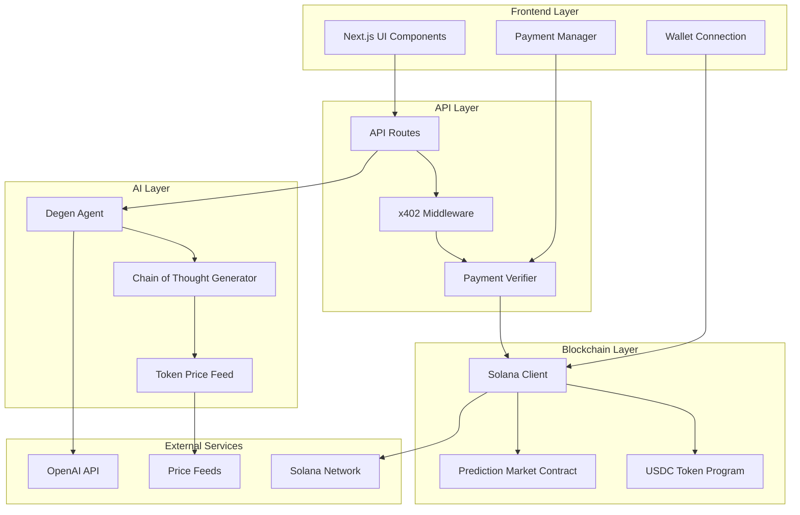

# RektOrRich_Agent Design Document

## Overview

RektOrRich_Agent is a gamified AI prediction market dApp that combines blockchain technology, AI-powered trading analysis, and payment-gated content delivery. The system consists of a Next.js frontend with cyberpunk aesthetics, Solana blockchain integration for payments and betting, and an AI agent that generates crypto trading predictions with personality-driven commentary.

The core innovation lies in the HTTP 402 payment wall implementation that gates the AI's "Chain of Thought" reasoning, creating a premium content model where users pay to access trading insights before placing bets on the AI's predictions.

## Architecture

### High-Level Architecture



### Component Architecture

The system follows a modular architecture with clear separation of concerns:

- **Presentation Layer**: React components with cyberpunk styling
- **Business Logic Layer**: API routes handling payments, AI interactions, and market operations
- **Data Layer**: Solana blockchain for persistent state and payments
- **Integration Layer**: External APIs for AI and price data

## Components and Interfaces

### Frontend Components

#### Core UI Components
- `DegenDashboard`: Main interface displaying current analysis and betting options
- `ChainOfThoughtViewer`: Component handling blurred/revealed AI reasoning
- `PaymentGate`: Manages unlock button and payment flow
- `PredictionMarket`: Betting interface for Win/Loss predictions
- `AgentPersonality`: Displays Degen agent avatar and status
- `MarketHistory`: Shows past predictions and outcomes

#### Wallet Integration
- `WalletProvider`: Solana wallet connection management
- `TransactionManager`: Handles payment and betting transactions
- `BalanceDisplay`: Shows user USDC balance and betting history

### Backend API Routes

#### Payment System
- `POST /api/unlock/[decisionId]`: Initiates payment for Chain of Thought access
- `GET /api/verify/[transactionId]`: Verifies payment completion
- `GET /api/content/[decisionId]`: Returns Chain of Thought (with 402 protection)

#### AI Agent System
- `POST /api/agent/analyze`: Triggers new token analysis
- `GET /api/agent/decisions`: Returns current and historical trading decisions
- `POST /api/agent/personality`: Updates Degen agent configuration

#### Prediction Markets
- `POST /api/markets/create`: Creates new prediction market for agent decision
- `POST /api/markets/[marketId]/bet`: Places user bet on market outcome
- `POST /api/markets/[marketId]/resolve`: Resolves market based on actual performance

### Blockchain Integration

#### Solana Programs
- **Payment Verification Contract**: Validates USDC payments for content access
- **Prediction Market Contract**: Manages betting pools and outcome resolution
- **Agent Registry Contract**: Tracks agent performance and reputation

#### Transaction Types
- **Content Payment**: 0.5 USDC transfer for Chain of Thought access
- **Market Bet**: Variable USDC amount wagered on prediction outcome
- **Winnings Claim**: Distribution of market winnings to successful predictors

## Data Models

### Core Data Structures

```typescript
interface TradingDecision {
  id: string;
  tokenSymbol: string;
  decision: 'LONG' | 'SHORT';
  confidence: number;
  timestamp: Date;
  currentPrice: number;
  chainOfThought?: string; // Only populated after payment
  isUnlocked: boolean;
  marketId?: string;
}

interface ChainOfThought {
  decisionId: string;
  reasoning: string;
  marketAnalysis: string;
  riskAssessment: string;
  degenCommentary: string;
  priceTargets: {
    bullish: number;
    bearish: number;
  };
}

interface PredictionMarket {
  id: string;
  decisionId: string;
  totalPool: number;
  winBets: number;
  lossBets: number;
  resolutionTime: Date;
  isResolved: boolean;
  outcome?: 'WIN' | 'LOSS';
}

interface UserBet {
  id: string;
  userId: string;
  marketId: string;
  prediction: 'WIN' | 'LOSS';
  amount: number;
  timestamp: Date;
  isWinning?: boolean;
  payout?: number;
}

interface DegenAgent {
  personality: {
    riskTolerance: 'EXTREME' | 'HIGH' | 'MODERATE';
    tradingStyle: 'MOMENTUM' | 'CONTRARIAN' | 'HYPE_DRIVEN';
    slangIntensity: number; // 1-10 scale
  };
  performance: {
    totalPredictions: number;
    correctPredictions: number;
    averageReturn: number;
    winStreak: number;
  };
}

interface PaymentVerification {
  transactionSignature: string;
  amount: number;
  sender: string;
  recipient: string;
  timestamp: Date;
  isVerified: boolean;
  contentId: string;
}
```

### Database Schema

```sql
-- Trading Decisions Table
CREATE TABLE trading_decisions (
  id UUID PRIMARY KEY,
  token_symbol VARCHAR(10) NOT NULL,
  decision VARCHAR(5) NOT NULL CHECK (decision IN ('LONG', 'SHORT')),
  confidence INTEGER CHECK (confidence >= 0 AND confidence <= 100),
  timestamp TIMESTAMP DEFAULT NOW(),
  current_price DECIMAL(18, 8),
  market_id UUID REFERENCES prediction_markets(id)
);

-- Chain of Thought Content (encrypted)
CREATE TABLE chain_of_thought (
  decision_id UUID PRIMARY KEY REFERENCES trading_decisions(id),
  encrypted_content TEXT NOT NULL,
  encryption_key_hash VARCHAR(64) NOT NULL
);

-- Payment Verifications
CREATE TABLE payment_verifications (
  transaction_signature VARCHAR(88) PRIMARY KEY,
  decision_id UUID REFERENCES trading_decisions(id),
  amount DECIMAL(18, 8) NOT NULL,
  sender VARCHAR(44) NOT NULL,
  timestamp TIMESTAMP DEFAULT NOW(),
  is_verified BOOLEAN DEFAULT FALSE
);

-- Prediction Markets
CREATE TABLE prediction_markets (
  id UUID PRIMARY KEY,
  decision_id UUID REFERENCES trading_decisions(id),
  total_pool DECIMAL(18, 8) DEFAULT 0,
  win_bets DECIMAL(18, 8) DEFAULT 0,
  loss_bets DECIMAL(18, 8) DEFAULT 0,
  resolution_time TIMESTAMP NOT NULL,
  is_resolved BOOLEAN DEFAULT FALSE,
  outcome VARCHAR(4) CHECK (outcome IN ('WIN', 'LOSS'))
);

-- User Bets
CREATE TABLE user_bets (
  id UUID PRIMARY KEY,
  user_wallet VARCHAR(44) NOT NULL,
  market_id UUID REFERENCES prediction_markets(id),
  prediction VARCHAR(4) NOT NULL CHECK (prediction IN ('WIN', 'LOSS')),
  amount DECIMAL(18, 8) NOT NULL,
  timestamp TIMESTAMP DEFAULT NOW(),
  transaction_signature VARCHAR(88) UNIQUE
);
```

## Correctness Properties

*A property is a characteristic or behavior that should hold true across all valid executions of a system-essentially, a formal statement about what the system should do. Properties serve as the bridge between human-readable specifications and machine-verifiable correctness guarantees.*

Based on the prework analysis, I'll now perform a property reflection to eliminate redundancy before writing the correctness properties:

**Property Reflection:**
- Properties 1.2, 1.3, 1.4 can be combined into a comprehensive "Trading decision display" property
- Properties 2.1, 2.2, 2.3 can be combined into a "Payment unlock flow" property  
- Properties 3.1, 3.2 can be combined into a "Bet placement validation" property
- Properties 5.2, 5.3, 5.4 can be combined into a "UI styling consistency" property
- Properties 6.1, 6.2, 6.3 can be combined into a "Payment verification flow" property
- Properties 7.1, 7.3, 7.5 can be combined into a "Real-time updates" property
- Properties 8.1, 8.2, 8.3, 8.4 can be combined into a "Error handling resilience" property

### Property 1: Trading decision display completeness
*For any* trading decision generated by the Degen_Agent, the display should include token symbol, current price, timestamp, decision type (LONG/SHORT), and blurred reasoning content
**Validates: Requirements 1.2, 1.3**

### Property 2: Chronological ordering preservation
*For any* set of trading decisions, they should be displayed in chronological order based on their timestamps
**Validates: Requirements 1.4**

### Property 3: Payment unlock flow integrity
*For any* unlock request with valid 0.5 USDC payment, the system should verify the transaction and reveal the complete Chain_of_Thought content
**Validates: Requirements 2.1, 2.2, 2.3**

### Property 4: Payment failure state preservation
*For any* failed payment verification, the system should maintain blurred content state and display appropriate error messaging
**Validates: Requirements 2.4**

### Property 5: Unlock state persistence
*For any* successfully unlocked trading decision, the unlocked state should persist across user sessions
**Validates: Requirements 2.5**

### Property 6: Bet placement validation
*For any* bet placement attempt, the system should validate sufficient funds, require wager amount specification, and create blockchain transactions only for valid bets
**Validates: Requirements 3.1, 3.2, 3.5**

### Property 7: Market resolution accuracy
*For any* expired prediction market, the system should automatically resolve based on actual token performance and distribute winnings proportionally to correct predictions
**Validates: Requirements 3.3, 3.4**

### Property 8: Degen personality consistency
*For any* generated trading commentary, the content should include required crypto slang terminology ("WAGMI", "Rekt", "Ape in", "Diamond hands")
**Validates: Requirements 4.1**

### Property 9: UI styling consistency
*For any* user interface element, the system should apply cyberpunk/neon aesthetic with appropriate blur effects for locked content and consistent hover animations
**Validates: Requirements 5.2, 5.3, 5.4**

### Property 10: Responsive design compliance
*For any* screen size or device type, the interface should maintain proper layout and functionality
**Validates: Requirements 5.5**

### Property 11: HTTP 402 implementation correctness
*For any* unauthorized request to protected content endpoints, the system should return HTTP 402 status codes and maintain access control
**Validates: Requirements 6.1, 6.4**

### Property 12: Payment verification accuracy
*For any* payment verification request, the system should validate Solana transaction signatures, amounts (0.5 USDC), and grant access only for valid payments
**Validates: Requirements 6.2, 6.3, 6.5**

### Property 13: Real-time update performance
*For any* market resolution, price change, or winning distribution, all user interfaces should update within 30 seconds and display current information
**Validates: Requirements 7.1, 7.3, 7.5**

### Property 14: Portfolio display completeness
*For any* user portfolio view, the display should include current bet positions, potential winnings, and historical performance data
**Validates: Requirements 7.2**

### Property 15: Active bet timer accuracy
*For any* user with active bets, the system should display accurate countdown timers until market resolution
**Validates: Requirements 7.4**

### Property 16: Error handling resilience
*For any* system error (network, API, database, or component failure), the system should implement appropriate retry logic, timeout handling, error logging, and graceful degradation
**Validates: Requirements 8.1, 8.2, 8.3, 8.4, 8.5**

## Error Handling

### Payment System Errors
- **Transaction Failures**: Implement exponential backoff retry mechanism for Solana network issues
- **Insufficient Funds**: Validate user balance before transaction initiation
- **Invalid Signatures**: Reject malformed or invalid transaction signatures with clear error messages
- **Network Timeouts**: Implement 30-second timeout with user feedback for blockchain operations

### AI Agent Errors
- **API Rate Limits**: Implement request queuing and retry logic for OpenAI API calls
- **Content Generation Failures**: Provide fallback generic responses while maintaining Degen personality
- **Token Data Unavailable**: Display appropriate messaging when price feeds are unavailable
- **Analysis Timeouts**: Set maximum analysis time limits with progress indicators

### Market Resolution Errors
- **Price Feed Failures**: Implement multiple price source validation for market resolution
- **Calculation Errors**: Use decimal precision libraries for accurate payout calculations
- **Distribution Failures**: Implement transaction batching with failure recovery for winnings distribution

### UI/UX Error Handling
- **Wallet Connection Issues**: Provide clear instructions for wallet setup and connection
- **Loading State Management**: Implement proper loading indicators and timeout handling
- **Responsive Design Failures**: Ensure graceful degradation on unsupported devices
- **Real-time Update Failures**: Implement fallback polling when WebSocket connections fail

## Testing Strategy

### Dual Testing Approach

The RektOrRich_Agent system requires both unit testing and property-based testing to ensure comprehensive coverage:

**Unit Testing Requirements:**
- Unit tests verify specific examples, edge cases, and integration points
- Focus on concrete scenarios like specific payment amounts, error conditions, and UI interactions
- Test individual component behavior and API endpoint responses
- Validate specific user flows and error handling paths

**Property-Based Testing Requirements:**
- Property tests verify universal properties across all possible inputs using **fast-check** library for TypeScript/JavaScript
- Each property-based test must run a minimum of 100 iterations
- Property tests handle the broad input space while unit tests catch specific edge cases
- Each property-based test must include a comment with the exact format: **Feature: rekto-rich-agent, Property {number}: {property_text}**

**Testing Framework Configuration:**
- **Unit Testing**: Jest with React Testing Library for frontend components
- **Property-Based Testing**: fast-check library with Jest integration
- **Integration Testing**: Playwright for end-to-end user flows
- **Blockchain Testing**: Solana Test Validator for transaction testing

**Key Testing Areas:**
1. **Payment Flow Testing**: Verify 402 implementation, transaction validation, and content unlocking
2. **AI Agent Testing**: Validate personality consistency, content generation, and decision logic
3. **Market Resolution Testing**: Test betting mechanics, payout calculations, and timing accuracy
4. **UI Component Testing**: Verify responsive design, styling consistency, and interactive elements
5. **Error Handling Testing**: Simulate various failure conditions and validate recovery mechanisms

**Property-Based Test Configuration:**
- Minimum 100 iterations per property test to ensure statistical confidence
- Custom generators for trading decisions, payment transactions, and user interactions
- Shrinking enabled to find minimal failing examples
- Timeout configuration for blockchain-dependent tests

The combination of unit and property-based testing ensures both specific functionality correctness and general system behavior validation across the entire input space.